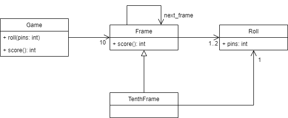

# Instrucciones
Los bolos son un juego donde los jugadores tiran una bola pesada para
tumbar unos pines organizados en forma de triángulo.

El objetivo del ejercicio es escribir un programa para llevar el registro del
puntaje de un juego de bolos.

## Puntaje en un juego de bolos
Un juego consiste en 10 ***frames*** (cuadros). Un ***frame*** está compuesto de uno o dos tiradas
de la bola (***rolls***) con 10 pines parados en el inicio del frame. Existen tres casos para
la tabulación de un frame.

1. Un frame abierto (***open frame***) es cuando un puntaje de 10 o menos es obtenido para el frame. En
este caso el puntaje del frame es el número de pines tumbados.
2. Un ***spare*** es cuando los 10 pines son tumbados en el segundo lanzamiento. El valor
total de un spare es 10 más el número de pines tumbados en el siguiente lanzamiento.
3. Un ***strike*** es cuando los 10 pines son tumbados en el primer lanzamiento. El valor
total de un *strike* es 10 más el número de pines tumbados en los siguientes dos
lanzamientos. Si un *strike* es inmediatamente seguido por un segundo *strike*, entonces
el valor del primer *strike* no puede ser determinado hasta que la bola sea lanzada una
vez más

Acá se presenta un ejemplo de 3 frames

| Frame 1    | Frame 2    | Frame 3          |
|------------|------------|------------------|
| X (strike) | 5/ (spare) | 9 0 (open frame) |

- El puntaje del Frame 1 es: 10 + 5 + 5 = 20
- El puntaje del Frame 2 es: 5 + 5 + 9 = 19
- El puntaje del Frame 3 es: 9 + 0 = 9

Esto quiere decir que el puntaje actual es 48.

El frame 10 en un juego es un caso especial. Si alguien logra un *strike* o un *spare*,
entonces obtienen un lanzamiento extra (***fill ball***). El lanzamiento extra existe para
calcular el total del frame 10. Lograr un *strike* o *spare* en el lanzamiento extra no le
da al jugador más lanzamientos extra. El valor total del frame 10 será el total de pines
tumbados.

Por ejemplo:

- Para un frame 10 que tenga X 1/ (*strike* y *spare*), el valor total será 20.
- Para un frame 10 que tenga XXX (tres *strike*), el valor total será 30.

## Requisitos
Implemente el código necesario para llevar registro del puntaje de un juego de bolos. Tenga
en cuenta el siguiente modelo

Para la implementación, lo que se va a verificar es lo que hacen los métodos de la
clase **Game**, así que tenga en cuenta lo siguiente:

- `roll(pins: int)` este método es llamado cada vez que un jugador lanza una bola. El argumento
es el número de pines que son tumbados.
- `score(): int` este método es llamado al final del juego y retorna el score total del
juego.

### Manejo de excepciones
Para el ejercicio también se requiere que arroje una excepción cuando las reglas de juego
o cálculo de puntaje no son seguidas. La implementación solo pasará las pruebas si se arroja
la excepción y se incluye un mensaje con ella.

Para este caso se deben manejar dos tipos de excepciones incluidas en python:

- IndexError  
- ValueError

Aunque las excepciones ya vienen en python, se deben arrojar incluyendo mensajes
significativos para el dominio de la aplicación.
